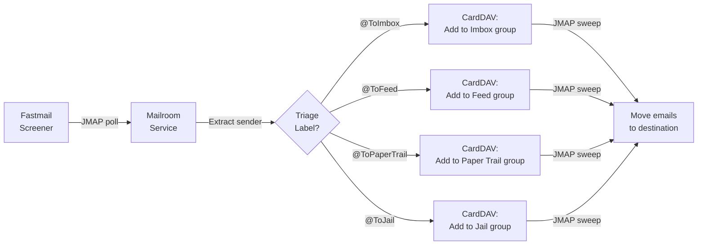

<objective>
Fix two bugs: (1) GitHub Actions Docker build failing due to cache export not supported on the default docker driver, and (2) Mermaid flowchart in architecture docs not rendering on GitHub.

Purpose: Restore CI/CD pipeline and fix documentation rendering.
Output: Working build.yaml and properly rendering architecture.md Mermaid chart.
</objective>

<execution_context>
@/Users/flo/.claude/get-shit-done/workflows/execute-plan.md
@/Users/flo/.claude/get-shit-done/templates/summary.md
</execution_context>

<context>
@.github/workflows/build.yaml
@docs/architecture.md
</context>

<tasks>

<task type="auto">
  <name>Task 1: Fix GitHub Actions Docker build cache error</name>
  <files>.github/workflows/build.yaml</files>
  <action>
Add a `docker/setup-buildx-action@v3` step AFTER the checkout step and BEFORE the "Log in to GHCR" step. This creates a builder instance using the `docker-container` driver, which supports GHA cache backends (`type=gha`).

Insert this block after `- uses: actions/checkout@v4`:

```yaml
      - name: Set up Docker Buildx
        uses: docker/setup-buildx-action@v3
```

No other changes to build.yaml. The existing `cache-from` and `cache-to` directives are correct once Buildx is set up.
  </action>
  <verify>
    <automated>grep -q "setup-buildx-action" .github/workflows/build.yaml && echo "PASS" || echo "FAIL"</automated>
    <manual>Push to main and verify the GitHub Actions workflow completes successfully</manual>
  </verify>
  <done>build.yaml contains setup-buildx-action step before the build-push step, enabling GHA cache support</done>
</task>

<task type="auto">
  <name>Task 2: Fix Mermaid flowchart rendering in architecture docs</name>
  <files>docs/architecture.md</files>
  <action>
Replace the Mermaid code block (lines 7-16) with a fixed version that addresses three issues:

1. Replace `\n` in node labels with `<br/>` for cross-renderer compatibility
2. Replace the `&` join syntax on the convergence line (`D & E & F & G -->`) with four individual edges (one per node), since `&` join is not reliably supported in all Mermaid renderers including GitHub
3. Wrap node labels containing special characters (`:` and `@`) in double quotes

The fixed Mermaid block should be:



Keep ALL other content in architecture.md unchanged.
  </action>
  <verify>
    <automated>python3 -c "
content = open('docs/architecture.md').read()
assert '<br/>' in content, 'Missing <br/> replacements'
assert '&' not in content.split('```mermaid')[1].split('```')[0], 'Still has & join syntax'
assert '\"@To' in content, 'Missing quoted @To labels'
print('PASS')
"</automated>
    <manual>View docs/architecture.md on GitHub and confirm the Mermaid chart renders correctly</manual>
  </verify>
  <done>Mermaid flowchart uses quoted labels, br tags, and individual edges -- renders correctly on GitHub</done>
</task>

</tasks>

<verification>
Both files modified, both automated checks pass. Full verification requires pushing to GitHub and confirming (1) the Actions workflow succeeds and (2) the Mermaid chart renders in docs/architecture.md.
</verification>

<success_criteria>
- build.yaml includes setup-buildx-action step before build-push-action
- architecture.md Mermaid block uses double-quoted labels, `<br/>` instead of `\n`, and individual edges instead of `&` join syntax
</success_criteria>

<output>
After completion, create `.planning/quick/2-fix-failing-github-actions-workflow-and-/2-SUMMARY.md`
</output>
