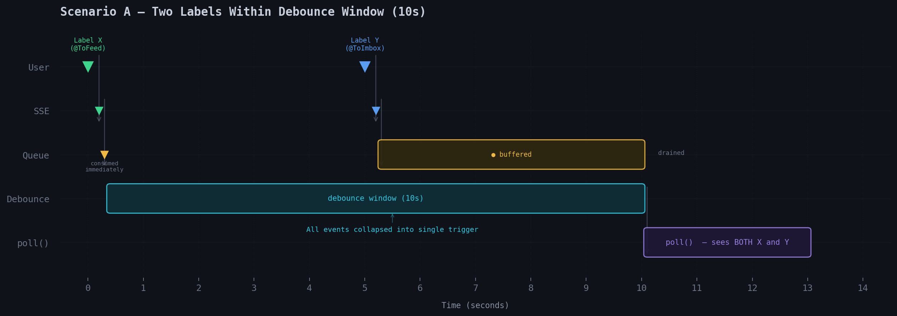
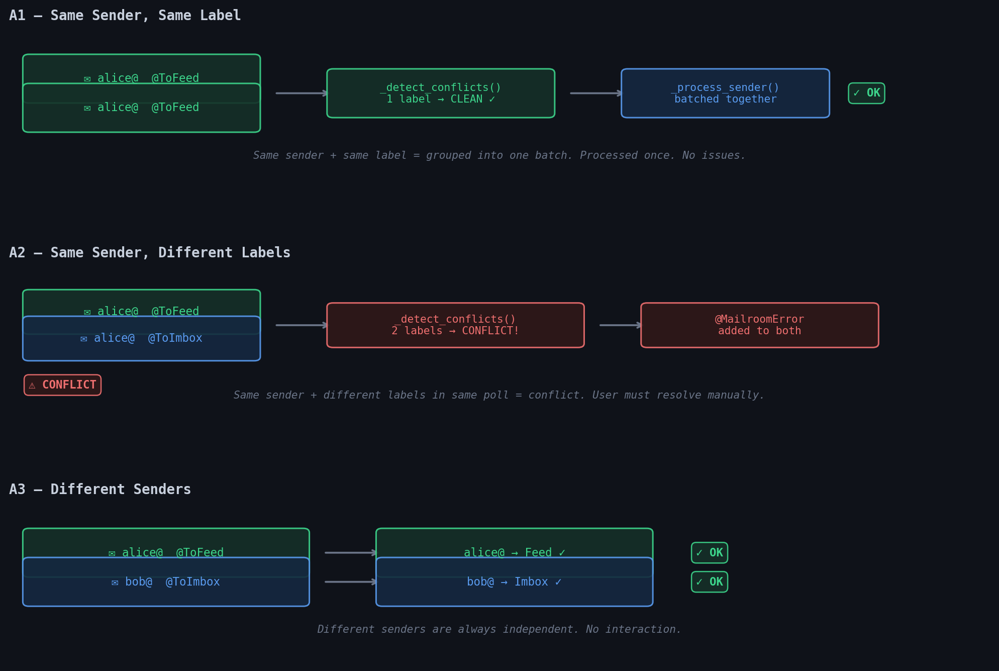
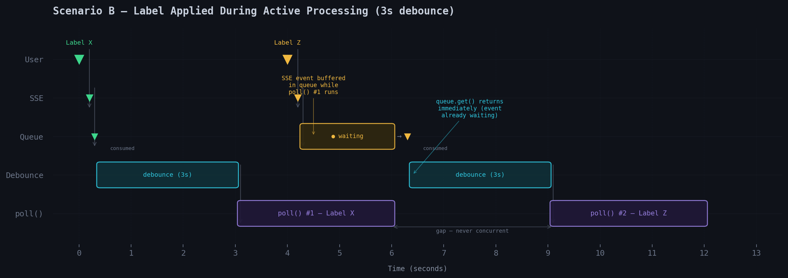
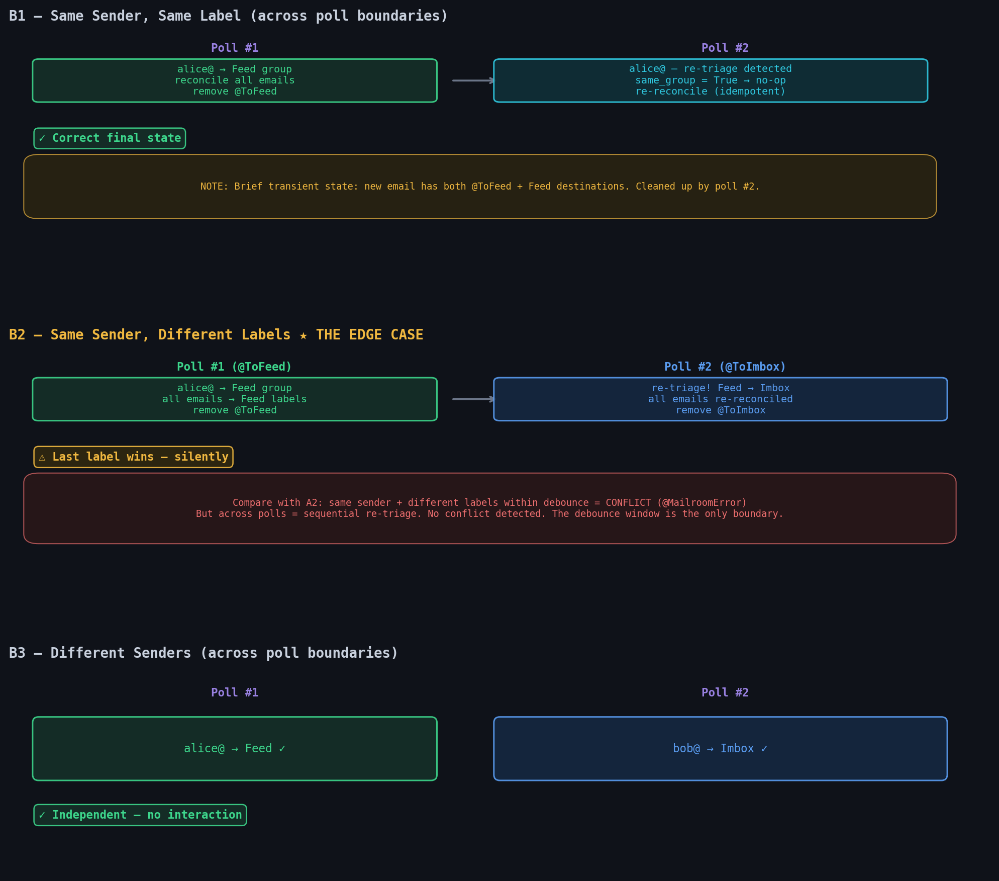
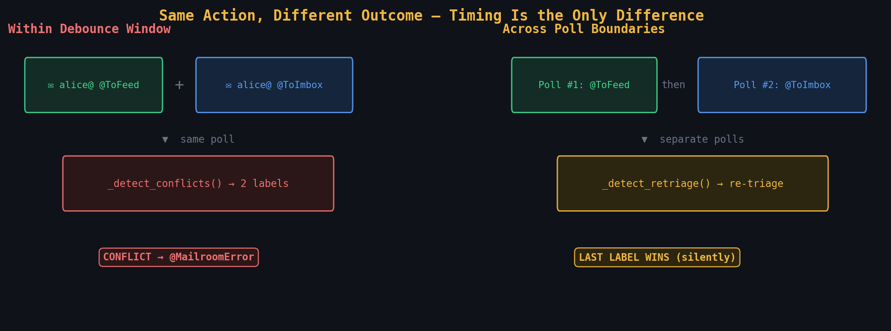

# Debounce & Concurrency Analysis

**Date:** 2026-03-05
**Scope:** What happens when multiple action labels are applied in rapid succession or during active processing?

---

## Architecture Summary

The main loop is **single-threaded**. There is **no async lock, mutex, or semaphore** anywhere in the codebase — and none is needed, because `poll()` runs sequentially on the main thread. The only concurrency boundary is between the main thread and the SSE listener daemon thread, bridged by a thread-safe `queue.Queue`.

```
SSE listener thread                    Main thread (polling loop)
─────────────────                      ─────────────────────────
Fastmail EventSource ──►               while not shutdown:
  event received     ──►                 event_queue.get(timeout=60)    ← blocks here
  queue.put("state_changed")             drain_queue()
                                         shutdown_event.wait(debounce)  ← sleep N seconds
                                         drain_queue()
                                         workflow.poll()                ← blocks here during processing
                                         (loop back to top)
```

**Key property:** While `poll()` is running, the main thread is blocked. No second `poll()` can start until the current one returns. SSE events that arrive during `poll()` accumulate in the queue and are picked up on the _next_ iteration.

---

## Scenario A: Two Labels Applied Within the Debounce Window

**Setup:** Debounce = 10 seconds. Apply label X at T=0, apply label Y at T=5.

### Timeline



The first SSE event unblocks `queue.get()` and starts the debounce sleep. The second event arrives during the sleep and buffers in the queue. When the debounce ends, `post_drain()` consumes it. Both events are collapsed into a **single poll trigger**.

`_collect_triaged()` then issues a batched JMAP `Email/query` for ALL triage label mailboxes — a **point-in-time snapshot** of Fastmail state. Since both labels were applied before T=10, both emails appear in the query results.

### Sub-scenarios: What poll() does with both labels



**A1 — Same sender, same label:** Both emails grouped under alice@, one label detected → CLEAN. Processed as a single batch. Contact upserted once, labels removed from both.

**A2 — Same sender, different labels:** Both emails grouped under alice@, two labels detected → CONFLICT. `@MailroomError` applied to both. Triage labels preserved. User must resolve manually.

**A3 — Different senders:** Each sender has one label → both CLEAN. Processed independently in the same poll cycle. No interaction.

| Sub-scenario | Outcome | Correct? |
|---|---|---|
| Same sender, same label | Batched together, processed once | Yes |
| Same sender, different labels | Conflict → @MailroomError | Yes |
| Different senders, any labels | Processed independently | Yes |

---

## Scenario B: Label Applied During Active Processing

**Setup:** Debounce = 3 seconds. Label X applied at T=0, processing starts at T=3 and takes 3 seconds, label Z applied at T=4 (1 second into processing).

### Timeline



The key visual: poll() #1 and poll() #2 are separated by a gap — **never concurrent**. Label Z's SSE event arrives while poll() #1 is running and sits in the queue. When poll() #1 finishes, `queue.get()` returns immediately (the event is already waiting), a new debounce window starts, and poll() #2 processes label Z.

### The critical question

What does poll() #1 do to emails that haven't been labeled yet?

When poll() #1 runs at T=3, `_collect_triaged()` queries `inMailbox: <label_X_id>`. It only sees emails with label X. The email with label Z (applied at T=4) is either not yet labeled or past the query phase — invisible to poll #1 either way.

### Sub-scenarios: What happens across two poll cycles



**B1 — Same sender, same label:** Poll #1 processes alice@ into Feed. Poll #2 picks up the new @ToFeed email, detects re-triage, finds `same_group=True` → no-op group change. Re-reconciles emails (idempotent). Brief transient state where the new email has both @ToFeed and Feed destinations, cleaned up within seconds.

**B2 — Same sender, different labels (THE EDGE CASE):** Poll #1 puts alice@ in Feed. Poll #2 detects re-triage, moves alice@ from Feed to Imbox. Last label wins silently — no conflict detected. See the deep dive below.

**B3 — Different senders:** Completely independent across poll cycles.

| Sub-scenario | Outcome | Correct? | Notes |
|---|---|---|---|
| Same sender, same label | Processed twice (idempotent) | Yes | Re-triage is a no-op (same group) |
| Same sender, different labels | Sequential re-triage (last label wins) | Debatable | No conflict detected — differs from Scenario A |
| Different senders, any labels | Processed independently | Yes | No interaction |

---

## The Interesting Edge Case: Scenario B2 Deep Dive

This is the most noteworthy behavioral difference. Same sender, same labels, different outcome — timing is the only variable:



| Timing | Same sender + @ToFeed + @ToImbox | Result |
|---|---|---|
| **Within debounce window** (Scenario A) | Both seen in single poll → CONFLICT → @MailroomError | User must resolve manually |
| **Across poll boundaries** (Scenario B) | Processed sequentially → RE-TRIAGE | Last label silently wins |

**Is this a bug?** It depends on intent:
- If the user applied two labels intentionally (testing re-triage): correct behavior
- If the user applied two labels by mistake: Scenario A catches it, Scenario B doesn't

**Why it happens:** The debounce window is the only "coalescing" boundary. Events outside it are treated as independent poll triggers. There's no mechanism to detect "this sender was just triaged 5 seconds ago in the previous poll."

### Could this cause corrupted state?

**No.** The operations are idempotent:
- Contact upsert: creates or updates (safe)
- Group management: re-triage flow handles group reassignment cleanly
- Email reconciliation: strips ALL managed labels first, then re-applies (full reset)
- Label removal: removing a label that's already gone is a no-op

The state is always consistent after each poll completes. The "risk" is semantic, not structural — the user might not realize their second label silently overrode the first.

---

## Concurrency Guarantee Summary

| Property | Status | Mechanism |
|---|---|---|
| No concurrent `poll()` | Guaranteed | Single-threaded main loop |
| No missed SSE events | Guaranteed | `queue.Queue` (thread-safe, unbounded) |
| Events during debounce coalesced | Guaranteed | `drain_queue()` before and after sleep |
| Events during `poll()` queued for next cycle | Guaranteed | Queue accumulates, next `get()` unblocks immediately |
| Triage label removed last | Guaranteed | Step 6 in `_process_sender()` (TRIAGE-06) |
| Failed processing auto-retries | Guaranteed | Label stays → next poll picks it up |
| No explicit lock/mutex needed | Correct | Architecture avoids shared mutable state |

---

## Potential Concerns

### 1. `_reconcile_email_labels()` sweeps ALL sender emails

This method calls `query_emails_by_sender()` which fetches ALL emails from a sender across ALL mailboxes — not just the ones in the triage mailbox. If a new email from the same sender arrives or gets labeled during processing, it could be swept up in the reconciliation. However, the operations are idempotent (strip all managed + re-apply), so this doesn't cause corruption.

### 2. No "processing lock" between polls for the same sender

If sender alice@ is processed in poll #1 and again in poll #2 (because a new label was applied during poll #1), there's no deduplication or lock. The second poll simply triggers re-triage. This is by design — re-triage handles all group reassignment cases.

### 3. Label removal is per-email, not atomic

Step 6 removes triage labels one email at a time:
```python
for email_id in email_ids:
    self._jmap.remove_label(email_id, label_id)
```

If this loop fails partway through (e.g., network error after removing 2 of 3 labels), the remaining email(s) still have their triage label. On the next poll, the sender is picked up again and re-processed (re-triage, idempotent). Safe but potentially redundant work.

### 4. JMAP queries are point-in-time snapshots

Between `_collect_triaged()` (which queries triage mailboxes) and `_reconcile_email_labels()` (which queries all sender emails), time passes. State could change on Fastmail's side during this window. But because operations are idempotent and triage labels are removed last, any inconsistency is resolved on the next poll.

---

## Conclusion

**There is no corrupted state risk.** The architecture ensures:
1. Polls are strictly sequential (single-threaded, no locks needed)
2. Events are never lost (queue buffers during processing)
3. Operations are idempotent (reconciliation is a full reset + re-apply)
4. Failed processing auto-retries (triage label removed last)

**The one behavioral subtlety:** Same sender + different labels produces different results depending on timing:
- Within debounce window → conflict detected → @MailroomError
- Across poll boundaries → sequential re-triage → last label wins silently

This is architecturally sound but worth being aware of as a user.

---

*Diagrams generated by `generate_diagrams.py` in this directory.*
