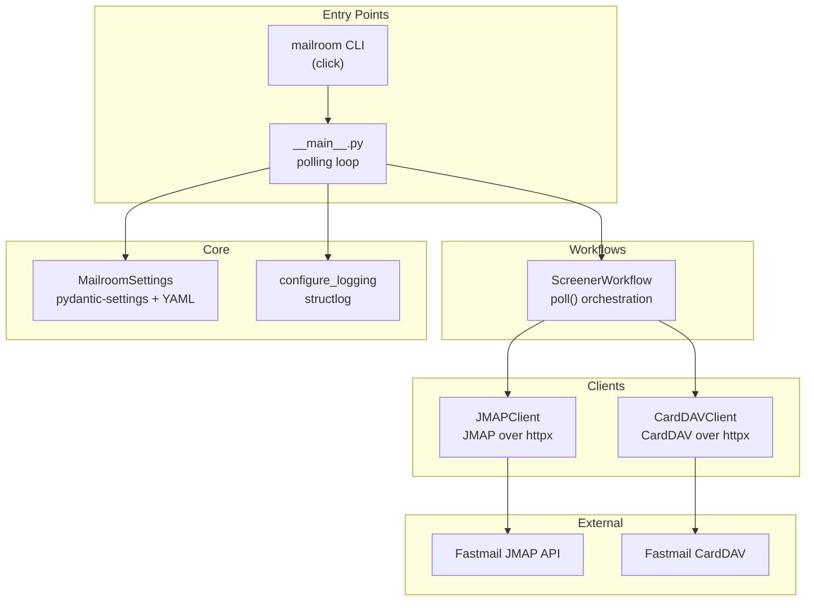
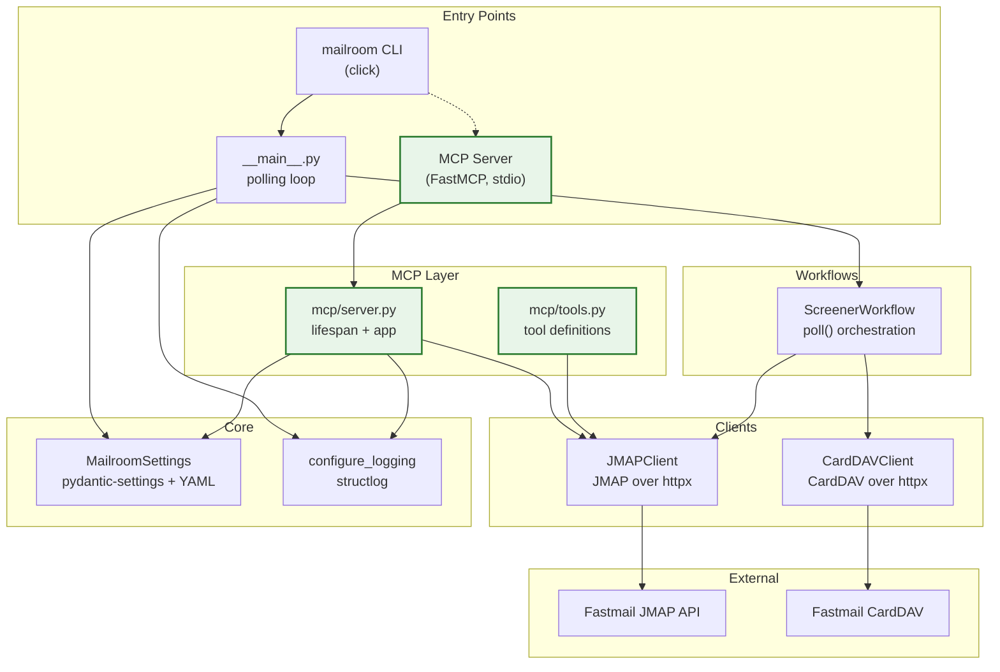
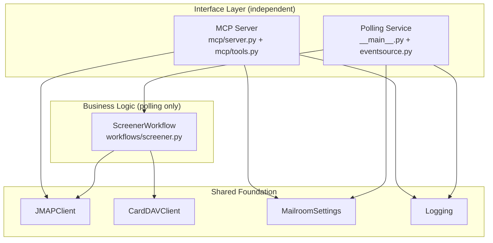
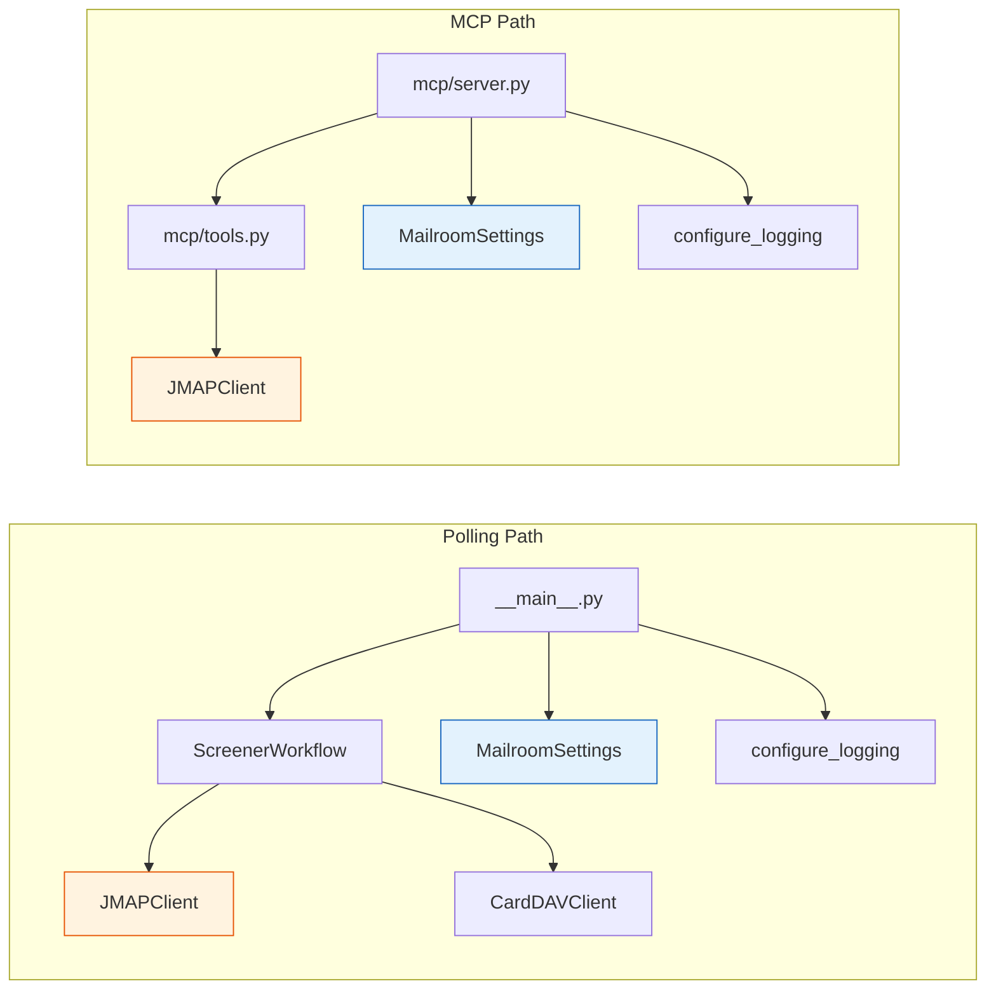
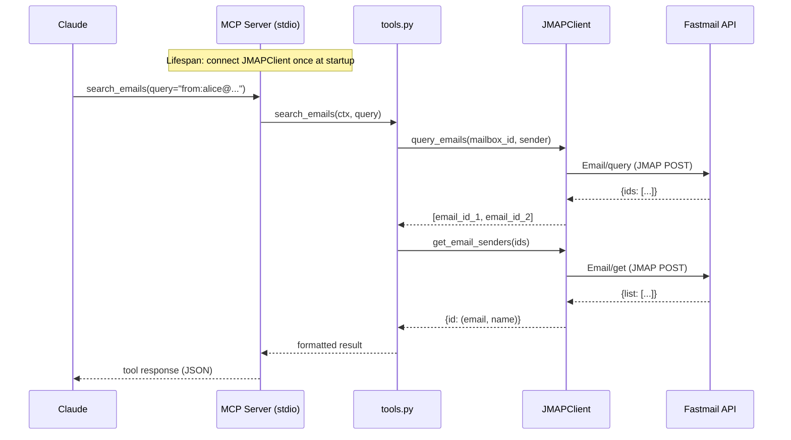
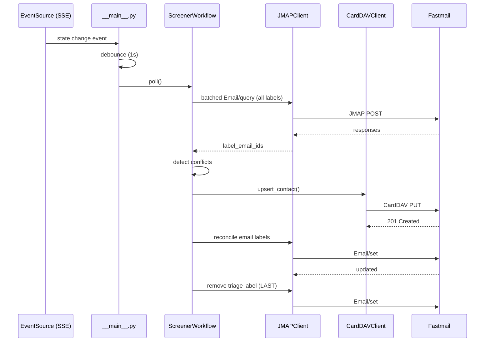
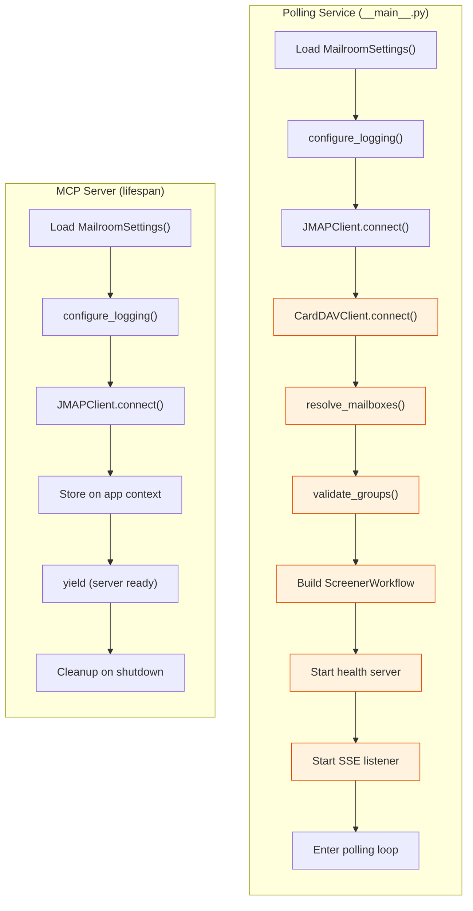
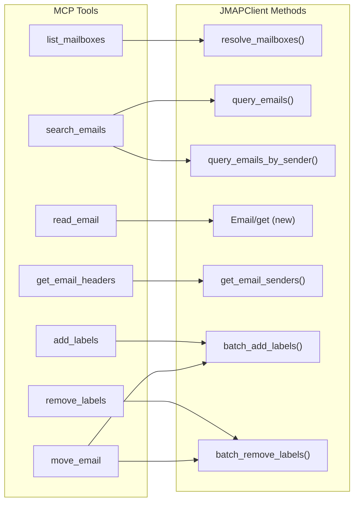

# MCP Architecture for Mailroom

> **Status**: Architecture reference (pre-implementation)
> **Related files**: [decisions.md](decisions.md) | [index.html](index.html) (interactive visual)

## The "Two Front Doors" Concept

Mailroom gains a **dual identity**: it remains an automated triage backend (the polling service) while also becoming an interactive email access layer for Claude via MCP. Both identities share the same foundation — clients, config, and credentials — but serve fundamentally different purposes.

| Identity | Purpose | Trigger | Runs As |
|---|---|---|---|
| **Polling Service** | Automated email triage | SSE events / timer | Long-running daemon (`mailroom run`) |
| **MCP Server** | Interactive email access | Claude tool calls | stdio subprocess (`mailroom mcp`) |

The key insight: **the hard work is already done**. The JMAP and CardDAV clients are battle-tested, protocol-correct, and cleanly separated from the automation logic. The MCP server is a new *interface* on top of existing *infrastructure*.

## Architecture: Before & After

### Current Architecture



### Future Architecture (with MCP)



## Package Structure Evolution

```
src/mailroom/
    __init__.py
    __main__.py          # polling service entry point (UNTOUCHED)
    cli.py               # click CLI (ADD: 2-line `mcp` subcommand)
    eventsource.py       # SSE listener (UNTOUCHED)

    core/
        __init__.py
        config.py        # MailroomSettings (UNTOUCHED)
        logging.py       # structlog config (UNTOUCHED)

    clients/
        __init__.py
        jmap.py          # JMAPClient (UNTOUCHED)
        carddav.py       # CardDAVClient (UNTOUCHED)

    workflows/
        __init__.py
        screener.py      # ScreenerWorkflow (UNTOUCHED)

    setup/               # (UNTOUCHED)
    reset/               # (UNTOUCHED)

    mcp/                 # NEW - entire directory
        __init__.py      # NEW - empty
        server.py        # NEW - FastMCP app + lifespan
        tools.py         # NEW - tool definitions
```

**Files touched**: 3 new + 2 modified (`cli.py` gets a subcommand, `pyproject.toml` gets the `mcp` dependency and entry point). **Zero changes** to existing business logic.

## Layer Diagram



Critical observation: **the MCP server never imports from `workflows/`**. It talks directly to the clients. The ScreenerWorkflow contains automation policy (conflict detection, retry safety, triage label sequencing) that doesn't belong in interactive tools.

## Dependency Flow



The two paths share `JMAPClient` and `MailroomSettings` (highlighted) but diverge at the logic layer. The polling path goes through `ScreenerWorkflow`; the MCP path goes directly to tools.

## Data Flow Diagrams

### MCP Tool Call Flow



### Polling Service Flow



## Initialization Sequence Comparison



The MCP lifespan is deliberately **simpler** — no CardDAV, no mailbox resolution, no workflow, no health server. It just needs a warm JMAPClient. The orange-highlighted steps in the polling path are automation-specific concerns that the MCP server doesn't need.

## Config Sharing

Both entry points load the same `MailroomSettings`:

```python
# __main__.py (polling)
settings = MailroomSettings()  # reads config.yaml + MAILROOM_* env vars
jmap = JMAPClient(token=settings.jmap_token)

# mcp/server.py (MCP lifespan)
settings = MailroomSettings()  # same config, same env vars
jmap = JMAPClient(token=settings.jmap_token)
```

**One config file, one set of credentials, two interfaces.** The MCP server doesn't need its own config — it inherits everything from the existing `config.yaml` and `MAILROOM_*` environment variables.

The MCP server may use `settings.triage.categories` to present mailbox context (e.g., "these are your triage categories") but doesn't enforce triage rules.

## MCP Tool Catalog

Phase 1 focuses on **email-only tools** using `JMAPClient`:

| Tool | Description | Maps to JMAPClient Method(s) |
|---|---|---|
| `list_mailboxes` | List all Fastmail mailboxes with IDs | `resolve_mailboxes()` (or raw `Mailbox/get`) |
| `search_emails` | Search emails by mailbox and/or sender | `query_emails()`, `query_emails_by_sender()` |
| `read_email` | Get full email content by ID | New: `Email/get` with body properties |
| `get_email_headers` | Get sender/subject/date for email IDs | `get_email_senders()` (extended) |
| `add_labels` | Add mailbox labels to emails | `batch_add_labels()` |
| `remove_labels` | Remove mailbox labels from emails | `batch_remove_labels()` |
| `move_email` | Move email between mailboxes | Combo: `batch_add_labels()` + `batch_remove_labels()` |



### Future Tools (Phase 2+)

| Tool | Description | Client |
|---|---|---|
| `list_contacts` | Browse contacts in a group | CardDAVClient |
| `search_contacts` | Find contact by email | CardDAVClient |
| `get_triage_status` | Show pending triage emails | JMAPClient |
| **Resources** | | |
| `mailroom://categories` | Current triage category config | MailroomSettings |
| `mailroom://mailboxes` | Mailbox name-to-ID mapping | JMAPClient |
| **Prompts** | | |
| `triage-helper` | Guide user through manual triage | Combo |

## Key Design Decisions

> Full rationale in [decisions.md](decisions.md)

1. **Monorepo** — one package, one venv, one test suite. The MCP server imports `mailroom.clients.jmap` directly.
2. **No config split** — same `config.yaml` + `MAILROOM_*` env vars serve both identities.
3. **No workflow dependency** — `mcp/tools.py` never imports from `workflows/`. Interactive tools are deliberate, not automated.
4. **Sync client in async tools** — JMAPClient uses `httpx.Client` (sync). FastMCP tools are async but call sync methods directly (fine for stdio single-concurrency).
5. **stdio transport** — Claude Desktop/Code launches the MCP server as a subprocess. No HTTP server needed.
6. **Warm client via lifespan** — `JMAPClient.connect()` runs once at startup, stored on app context. Not per-request.

## Entry Points Summary

```toml
# pyproject.toml
[project.scripts]
mailroom = "mailroom.cli:cli"         # existing
mailroom-mcp = "mailroom.mcp:main"    # new
```

```python
# cli.py addition
@cli.command()
def mcp():
    """Start the MCP server (stdio transport)."""
    from mailroom.mcp.server import app
    app.run()
```

## Future Evolution

1. **Contact tools** — Add CardDAV-backed tools for browsing/searching contacts. These work with the existing `CardDAVClient` as-is.
2. **JMAP Contacts migration** — When Fastmail's JMAP Contacts API stabilizes and Mailroom migrates from CardDAV, the MCP contact tools automatically benefit (same interface, new protocol underneath).
3. **MCP Resources** — Expose category config and mailbox mappings as MCP resources for context injection.
4. **MCP Prompts** — Pre-built conversation templates like "triage helper" that guide Claude through interactive email management.
5. **SSE transport** — If remote access is ever needed (unlikely for personal use), swap stdio for SSE. The tool definitions don't change.
