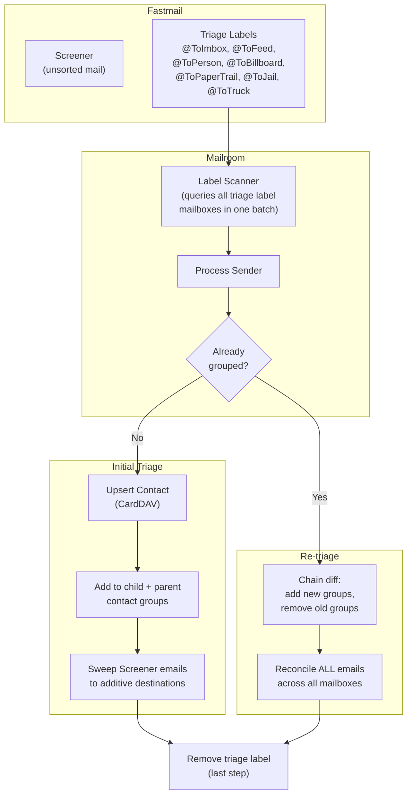
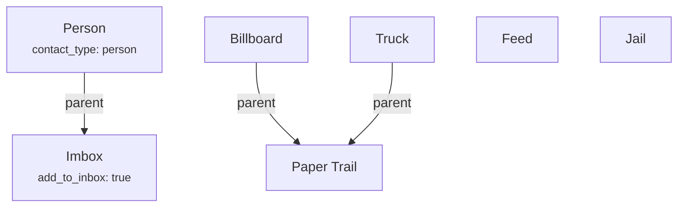

# Architecture

Mailroom is a polling service that triages incoming email in Fastmail. It connects to Fastmail via two protocols -- JMAP for email operations and CardDAV for contact management -- orchestrated by a workflow layer that implements the triage pipeline. The service runs as a single long-lived process with SSE push as the primary trigger and polling as a safety net.

## Triage Pipeline



**How it works:** The user applies a triage label (e.g., `@ToPerson`) to an email in the Screener. The label scanner queries all triage label mailboxes in a single batched JMAP request. For each labeled email, Mailroom identifies the sender, creates or updates their contact in the appropriate CardDAV group(s), reconciles email labels across all mailboxes, and removes the triage label last (for retry safety).

### Parent-Child Additive Filing

When a sender is triaged to a child category (e.g., Person, which has parent Imbox), filing is additive:

```
@ToPerson -> Contact added to: Person + Imbox groups
          -> Emails filed to:  Person + Imbox mailboxes
          -> Inbox: NOT added (Person has add_to_inbox: false)

@ToImbox  -> Contact added to: Imbox group only
          -> Emails filed to:  Imbox mailbox
          -> Inbox: added (Imbox has add_to_inbox: true)
```

The `add_to_inbox` flag is per-category and never inherited through the parent chain.

### Category Hierarchy



## Components

### ScreenerWorkflow

**File:** `src/mailroom/workflows/screener.py`

The orchestrator. `poll()` is the main entry point, executing one full triage cycle:

1. **Label scanning** -- Queries all triage label mailboxes in a single batched JMAP request (not just Screener). Per-label error detection with escalation threshold (3 consecutive failures before ERROR level).
2. Filter out emails already marked with `@MailroomError`
3. Detect conflicting triage labels (same sender, different labels)
4. Apply `@MailroomError` to conflicted senders
5. Process each clean sender:
   - **Re-triage detection** -- Search CardDAV for existing contact; if found in a group, this is a re-triage
   - **Contact upsert** -- Create or update contact in the target group with provenance tracking
   - **Group management** -- Initial triage: add to ancestor groups. Re-triage: chain diff (add new-only groups first, remove old-only groups)
   - **Email reconciliation** -- `_reconcile_email_labels()` handles both initial triage and re-triage: strips all managed destination labels + Screener from every email, applies new additive labels, adds Inbox only for Screener emails when `add_to_inbox` is true
   - Remove triage label (last step, for retry safety)

Contains business logic only -- no protocol details. Per-sender exceptions are caught to ensure one failing sender does not block others (retry on next poll).

### JMAPClient

**File:** `src/mailroom/clients/jmap.py`

Email operations via the JMAP protocol. Handles session discovery (account ID, API URL), mailbox resolution by name, batched email queries across multiple mailboxes, email sender extraction, per-email mailbox membership lookup, batch label add/remove operations with chunking (100 emails per request), and label management.

### CardDAVClient

**File:** `src/mailroom/clients/carddav.py`

Contact operations via the CardDAV protocol. Handles:

- **Discovery** -- PROPFIND-based principal, addressbook home, and addressbook URL resolution
- **Contact groups** -- Validation, membership checks (with infrastructure group exclusion), member listing, add/remove operations
- **Contact management** -- Email-based search via REPORT, creation (company or person vCards), merge-cautious upsert (fill empty fields, never overwrite), deletion for reset
- **Provenance tracking** -- Tracks infrastructure groups (e.g., the provenance group) separately from triage groups. `check_membership()` excludes infrastructure groups so they do not interfere with re-triage detection
- **Group reassignment** -- Add-to-new group FIRST, then remove-from-old (safe partial-failure order)
- **Triage history** -- Contact notes capture dated triage entries: `Triaged to {group} on {date}` for new contacts, `Re-triaged to {group} on {date}` for moves

### MailroomSettings

**File:** `src/mailroom/core/config.py`

Configuration loaded from `config.yaml` (YAML) plus environment variables for authentication credentials. The YAML file defines four sections: `triage` (categories and screener mailbox), `mailroom` (error/warning labels and provenance group), `polling` (interval and debounce), and `logging` (level).

Key features:
- **Category resolution** -- User-provided categories are validated and resolved into concrete objects with derived fields (label, contact_group, destination_mailbox)
- **Parent chain resolution** -- `get_parent_chain()` walks the parent hierarchy for additive filing
- **Validation** -- 7 rules checked at startup (duplicate names, circular chains, Inbox ban, etc.)
- **Computed properties** -- `triage_labels`, `label_to_category_mapping`, `required_mailboxes`, `contact_groups`, `resolved_categories`
- **String shorthand** -- `- Feed` in YAML is equivalent to `- name: Feed`
- **Config path override** -- `MAILROOM_CONFIG` env var overrides the default `config.yaml` path

See [config.md](config.md) for the full configuration reference.

## Contact Provenance

Mailroom distinguishes between contacts it created and contacts it adopted:

| Type | How Identified | Reset Behavior |
|------|---------------|----------------|
| **Created** (unmodified) | In provenance group, no user-added fields | Deleted |
| **Created** (user-modified) | In provenance group, has user-added fields | Warned, note stripped, provenance removed |
| **Adopted** | Not in provenance group, has Mailroom note | Note stripped only |

The provenance group (default: `Mailroom`) is tracked as infrastructure -- it is excluded from `check_membership()` so it does not interfere with re-triage detection. "User-modified" is detected by checking for vCard fields beyond Mailroom's managed set (version, uid, fn, n, email, note, org, prodid).

## Reset CLI

**File:** `src/mailroom/reset/resetter.py`

The `mailroom reset` command provides a provenance-aware undo operation:

- **Dry-run** (default) -- Plans what would be changed, reports counts
- **Apply** (`--apply`) -- Executes the cleanup with a confirmation prompt (defaults to decline for safety)

**7-step operation order:**

1. Move emails to Screener, then remove managed destination labels
2. Remove `@MailroomWarning` and `@MailroomError` from all emails
3. Remove contacts from all category groups
4. Apply `@MailroomWarning` to emails from created-but-modified contacts
5. Remove warned contacts from provenance group
6. Strip Mailroom notes from warned + adopted contacts (skip delete targets)
7. Delete unmodified created contacts

Non-interactive stdin aborts with an explicit message (no silent failure on piped input).

## Key Design Decisions

- **Triage label removed last:** If any step fails mid-processing, the triage label stays on the email. The next poll picks it up and retries automatically.
- **Error labels are additive:** `@MailroomError` is added without removing the triage label, so the user sees both the original label and the error indicator.
- **Company contacts by default, person contacts via @ToPerson:** The `@ToPerson` label creates a person-type vCard (with parsed first/last name) instead of the default company-type vCard.
- **Merge-cautious:** When upserting contacts, only empty fields are filled. Existing contact data is never overwritten.
- **Per-sender isolation:** A failure processing one sender does not affect other senders in the same poll cycle.
- **Parent-child additive semantics:** Children are fully independent (own label, group, mailbox). Parent relationship only means additive contact groups and additive mailbox filing.
- **add_to_inbox per-category only:** The flag is never inherited through the parent chain. Only Screener emails get Inbox visibility (not re-triaged emails).
- **Label scanning:** All triage label mailboxes are queried in a single batched JMAP request, not just the Screener. Per-label error detection with escalation threshold prevents one broken label from blocking all triage.
- **Provenance tracking:** Infrastructure groups are excluded from membership checks so the provenance group does not interfere with re-triage detection.
- **Safe group reassignment:** Add-to-new group FIRST, then remove-from-old. If the process fails partway, the contact is in extra groups (recoverable) rather than missing from groups (data loss).

## Planning

This project's planning and roadmap are managed with [GSD](https://github.com/flo/gsd). See `.planning/` for phase history, decisions, and roadmap.
